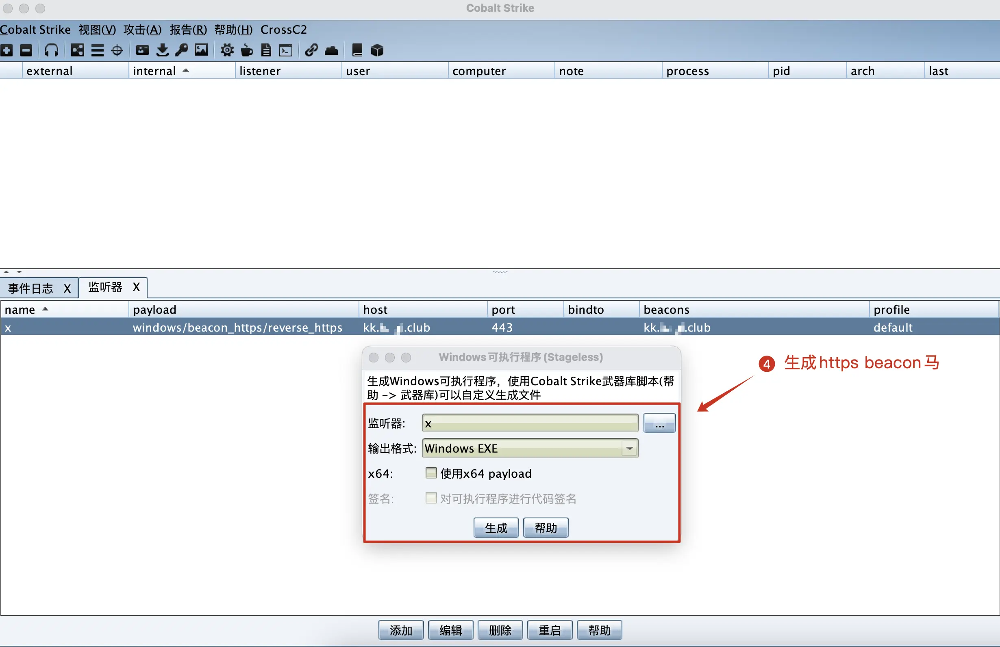

## cobalt strike后台隐藏 - vercel

### 0x01 简介

这是一个cs后台隐藏项目，由[vercel官方模版](https://github.com/vercel/examples/tree/main/python/flask)改编而来，原理类似云函数，设置cs的上线地址为一个指定域名，该域名解析后的ip归属于`vercel`，从而实现真实ip隐藏

### 0x02 部署

1. 创建vercel项目

2. 绑定域名

### 0x03 测试

1. 生成`https beacon`马

2. dns请求，解析出cs服务器ip为[76.76.21.9](https://x.threatbook.com/v5/ip/76.76.21.9)

3. 上线，执行命令

